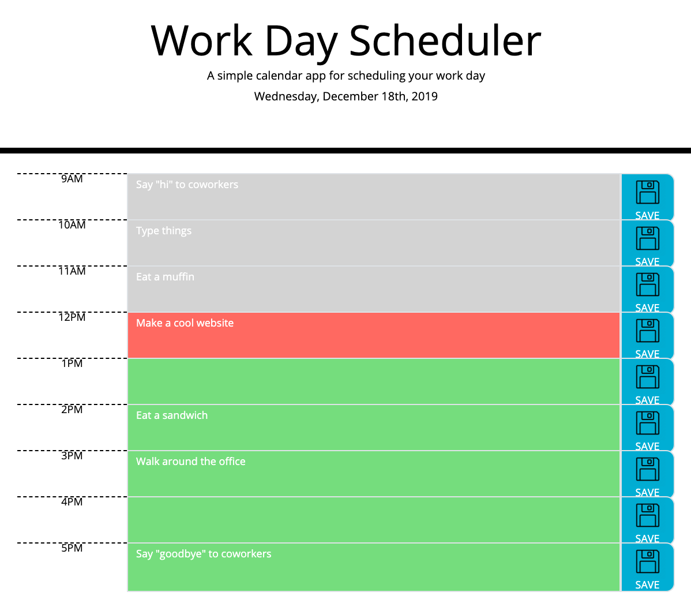

# day-planner

About the Application:
This is a day-planner (9am - 5pm) that can be used to schedule events. Any event entered into the planner gets saved to local storage by clicking the 'save' button. Upon refreshing, the events stay where they were saved. The event blocks are color-coded based on the current time, and the current date is at the top of the planner.

Link to Application:
[Day-Planner!](https://shanscirg.github.io/day-planner/)

Screenshot of Applcation:

